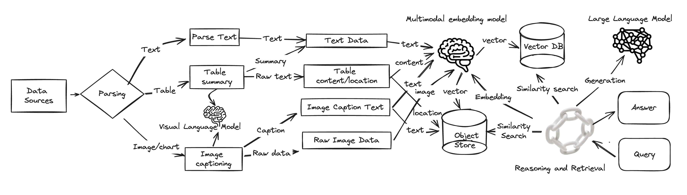
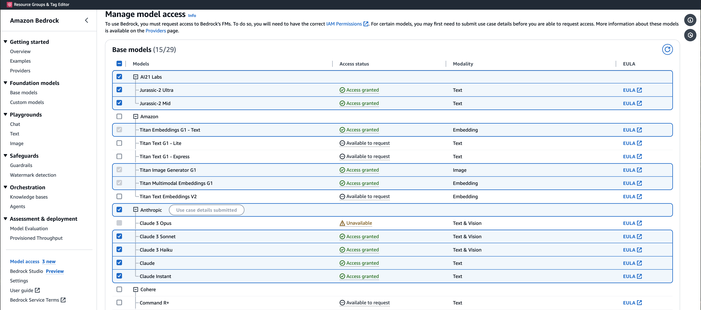
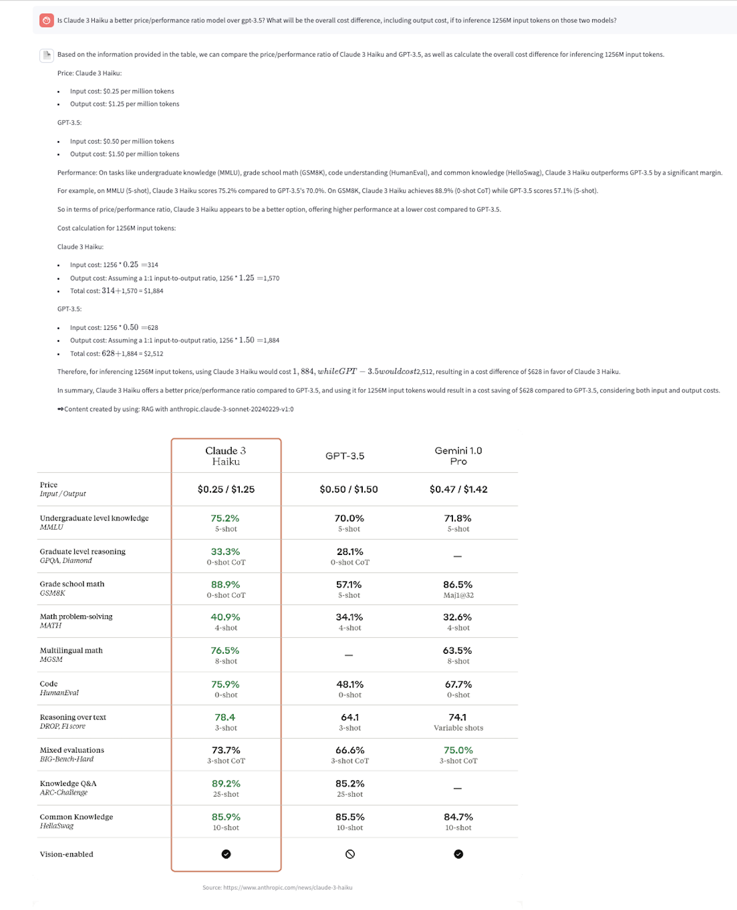

# ⚓️ Multi-modal Assistant With Advanced RAG And Amazon Bedrock 

Retrieval-Augmented Generation (RAG) models have emerged as a promising approach to enhancing the capabilities of language models by incorporating external knowledge from large text corpora. However, despite their impressive performance in various natural language processing tasks, RAG models still face several limitations that need to be addressed.

Naive RAG models face limitations such as missing content, reasoning mismatch, and challenges in handling multimodal data. While they can retrieve relevant information, they may struggle to generate complete and coherent responses when required information is absent, leading to incomplete or inaccurate outputs. Additionally, even with relevant information retrieved, the models may have difficulty correctly interpreting and reasoning over the content, resulting in inconsistencies or logical errors. Furthermore, effectively understanding and reasoning over multimodal data remains a significant challenge for these primarily text-based models.

In this blog post, we present a new approach named Multi-modal RAG (mmRAG) to tackle those existing limitations in greater detail. The solution intends to address these limitations for the practical generative AIassistant use cases. Additionally, we will examine potential solutions to enhance the capabilities of large language and visual language models with advanced Langchain capabilities, enabling them to generate more comprehensive, coherent, and accurate outputs while effectively handling multimodal data. Amazon Bedrock is a fully managed service that offers a choice of high-performing foundation models from leading AI companies, providing a broad set of capabilities to build generative AI applications with security, privacy, and responsible AI. 


## Release
- [3/21/24] Initial draft

**Usage and License Notices**: This project utilizes certain datasets and checkpoints that are subject to their respective original licenses. Users must comply with all terms and conditions of these original licenses, including but not limited to the [Amazon Terms of Use](https://aws.amazon.com/s) for the specific licenses for base vidual language models for tools (e.g. [Langchain community license](https://github.com/langchain-ai/langchain/blob/master/LICENSE for Langchain, for [Beautiful Soup](https://pypi.org/project/beautifulsoup4/) and [PyMuPDF](https://pypi.org/project/PyMuPDF/). 

Users are advised to verify that their utilization of the dataset and checkpoints adheres to all relevant laws and regulations. This project does not impose any additional constraints beyond those stipulated in the original licenses.

## Content
- [Install](#install)
- [Models](#models)
- [Tools](#tools)
- [Demo](#demo)

## Install

1. Install the required Python packages
   ```
   pip install -t requirements.txt
   ```
2. Request an AWS account to provision Bedrock model acess via [Amazon Bedrock console](https://us-west-2.console.aws.amazon.com/bedrock/home?region=us-west-2#/modelaccess)

3. Add aws credentials to your ~/.aws/credentials file
   ```
   [defualt]
   aws_access_key_id=<aws_account_id>
   aws_secret_access_key=<aws_account_key>
   region=us-west-2 
   ```

## Models

The demo sameple uses the following models from Amazon Bedrock.

  1. Text embedding: amazon.titan-embed-g1-text-02
  2. Image embedding: amazon.titan-embed-image-v1
  3. LLM/VLM: anthropic.claude-3-haiku-20240307-v1:0 and anthropic.claude-3-sonnet-20240229-v1:0 
  4. ASR: Whisper from open source
  5. Text Inference: Text Generation Inference (tgi v2.01) by Hugging Face 

## Tools

The following tools and package are used for the demo codes

  1. Web content parsing: Beatiful Soup
  2. PDF parsing Python package: PyMuPDF
  3. UI: Streamlit
  4. Orchstration: Langchain 

## Demo

Use the following bash CLI to kick off the demo sample.

```
streamlit run home.py --server.port <service_port>
```


